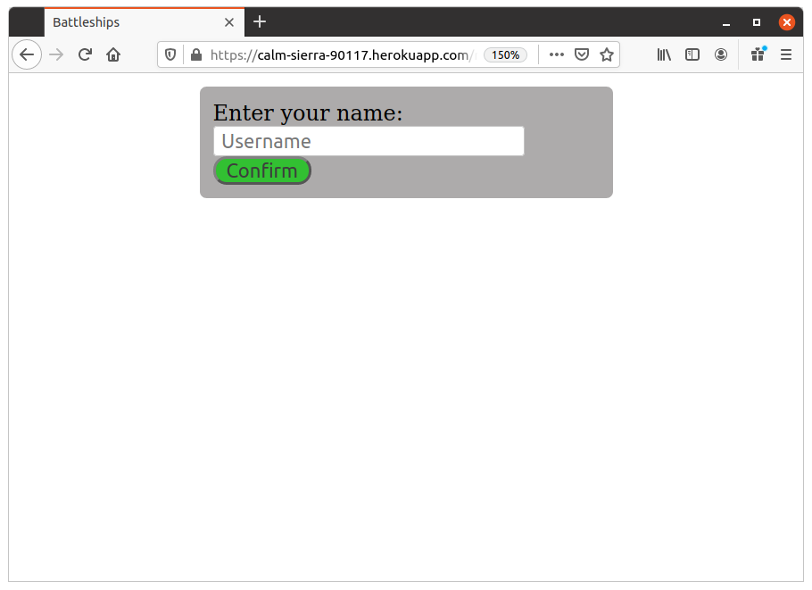
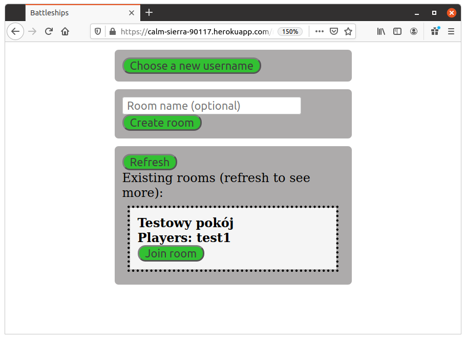
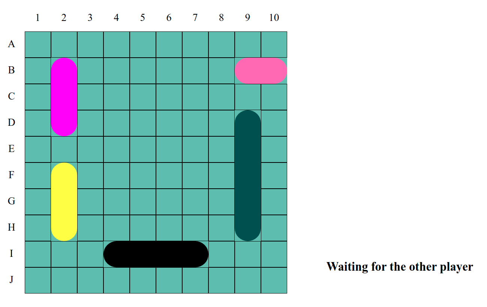

# Battleships - gra przeglądarkowa

## Autorzy: *Bartosz Troszka*, *Jakub Grobelny*

## 1. Opis aplikacji

Aplikacja jest implementacją gry w statki. Gracze wchodząc na stronę wybierają swoją nazwę użytkownika a następnie mają możliwość tworzenia nowych pokojów oraz dołączania do już istniejących. Gdy w jednym pokoju znajdzie się dwóch graczy oraz gdy rozstawią oni swoje statki na planszy, gra się rozpoczyna. Gracze na przemian wybierają pola na planszy, w które strzelają, a wygrywa ten, który jako pierwszy zniszczy wszystkie statki przeciwnika. Opuszczenie pokoju w trakcie gry skutkuje porażką i zakończeniem gry.

Nazwy użytkowników nie muszą być unikalne. Każdy użytkownik otrzymuje ciasteczko z unikatowym tokenem, który identyfikuje go w aplikacji.

Puste pokoje są usuwane. Utworzenie pokoju i natychmiastowe opuszczenie go skutkuje jego usunięciem.

## 2. Główne przypadki użycia

1. Wybór nazwy użytkownika – użytkownik po wejściu na stronę wpisuje swoją nazwę, która będzie wyświetlana na liście graczy w pokoju. Nazwa użytkownika musi być niepustym napisem złożonym z liter alfabetu angielskiego lub cyfr.

2. Przeglądanie listy pokojów – użytkownik po wybraniu nazwy otrzymuje listę aktywnych w danym momencie pokojów wraz z ich nazwami i nazwami znajdujących się w nich użytkowników.
3. Tworzenie nowych pokojów – użytkownik tworzy własny pokój i nadaje mu opcjonalną nazwę. Po utworzeniu użytkownik zostaje przeniesiony do pokoju.
4. Dołączanie do pokojów – użytkownik naciska przycisk przy wybranym pokoju w celu dołączenia do niego. Jeżeli w pokoju są wolne miejsca, to użytkownik zostaje przeniesiony do docelowego pokoju.

5. Granie w grę – użytkownik rozstawia swoje statki na planszy przeciągając je myszką. Zmiana między pionową i poziomą orientacją statków może zostać dokonana przy użyciu odpowiedniego przycisku. Po zakończeniu rozstawienia gracz sygnalizuje swoją gotowość do gry wciskając przycisk „Start game”. W momencie gdy pojawi się przeciwnik, który również będzie gotowy, gracz otrzyma wiadomość z informacją o rozpoczęciu gry. Od tego momentu opuszczenie pokoju skutkuje poddaniem gry. Gracz klika na pola na planszy przeciwnika, w które chce strzelać. Trafienie skutkuje przyznaniem kolejnego ruchu. Chybienie powoduje oddanie kolejki drugiemu graczowi.

## 3. Link do aplikacji: [https://calm-sierra-90117.herokuapp.com/](https://calm-sierra-90117.herokuapp.com/)

Aplikacja nie posiada kont.
